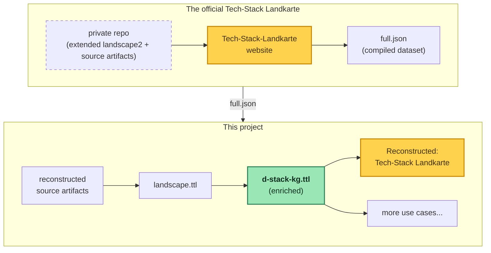

# Deutschland-Stack knowledge graph

This unofficial prototype explores possibilities that would arise from modeling the Deutschland-Stack as a knowledge graph. The data it uses is the reconstructed source artifact behind the compiled Landkarte dataset published online. The authoritative source is the official [Tech-Stack Landkarte](https://technologie.deutschland-stack.gov.de/).

## The big picture



## Building the knowledge graph
`src/1-build-kg`

| Step | What it does |
|---|---|
| **1. Fetch dataset** | Fetches [the compiled Landkarte dataset](https://technologie.deutschland-stack.gov.de/data/full.json) and its logos → `data/1-build-kg/upstream/` (`full.json` + metadata, `logos.zip`) |
| **2. Reconstruct source** | Reconstructs the landscape2 source files → `data/1-build-kg/reconstructed/` (`landscape.yml` + a minimal `settings.yml`)                                                               |
| **3. Validate roundtrip** | Structurally compares the rebuilt `full.json` against the authoritative one; to produce it, runs a full `landscape2 build` → `data/scratch/build/`                          |
| **4. Build graph** | Lifts `landscape.yml` to RDF with SPARQL Anything and transforms it via SPARQL queries into a knowledge graph → `data/1-build-kg/landscape.ttl`. More about the modeling choices along the way in [modeling-choices.md](modeling-choices.md) |

## Running

```bash
npm install

npm run 1-fetch # step 1
npm run 1-reconstruct # step 2

# step 3
brew install cncf/landscape2/landscape2 # landscape2 CLI is required
npm run 1-validate
landscape2 serve --landscape-dir data/scratch/build # optional: view the built site

# step 4 (needs java; the SPARQL Anything jar auto-downloads)
npm run 1-graph
```

## Data

`data/` mirrors the `src/` folder. Only two artefacts are committed:

- `data/1-build-kg/upstream/`: the fetched artifacts plus provenance
- `data/2-enrich-kg/d-stack-kg.ttl`: the knowledge graph (the deliverable)

The intermediates, the use-case projections and `data/scratch/` are gitignored.

## Enriching the graph
`src/2-enrich-kg`

_TODO_

```bash
npm run 2-enrich # writes data/2-enrich-kg/d-stack-kg.ttl
```

## Use cases
`src/3-use-cases`

### Landkarte roundtrip
Rebuilds the `landscape2` source files (`landscape.yml` + `settings.yml`) straight from the graph and proves the rebuilt site matches upstream.

```bash
npm run 3-landkarte          # graph → landscape.yml + settings.yml
npm run 3-landkarte:validate # rebuild via landscape2 and structurally compare to upstream
npm run 3-landkarte:serve    # view the rebuilt site (http://127.0.0.1:8000)
npm run 3-landkarte:page     # render it into the webapp (webapp/use-case/landkarte/)
```

The [deploy](.forgejo/workflows/deploy.yml) runs `3-landkarte` and `3-landkarte:page` to publish the Landkarte embedded in the [Tech-Stack Landkarte page](webapp/use-case/tech-stack-landkarte.html).

## Observations

A few things surfaced while working with the Landkarte's published artifacts:

- The two CSV files under Download (top right corner) are lossy exports of the build output (default landscape2 behaviour, not a BMDS addition), missing content compared to the `landscape.yml` and `settings.yml` they were built from. Those probably live in the repository the footer links to, which seems to have been public once but now returns a 404.
- The data model is inherited from the CNCF landscape and fits its new purpose imperfectly. Some fields are repurposed: license information appears under `summary.release_rate` and operating systems under `summary.personas`.
- Category and subcategory labels carry inconsistent leading whitespace — a mix of a normal space (U+0020) and an en-quad (U+2000) — so one category is split across several distinct strings. The reconstruction normalizes them to recover the four intended categories.

## Disclaimer

- Not an authoritative source. This is an unofficial reconstruction of official artifacts.
- The Landkarte data (`data/1-build-kg/upstream/full.json`) is content of the BMDS / Datenlabor BMI. No license is stated upstream; `data/1-build-kg/upstream/full.meta.json` is kept as provenance documentation.
- The item logos are kept verbatim in `data/1-build-kg/upstream/logos.zip` only to rebuild the site; no rights to them are claimed.
- Built with the help from AI coding tools; design decisions stay with the author, who reviews, understands and takes responsibility for every change.
