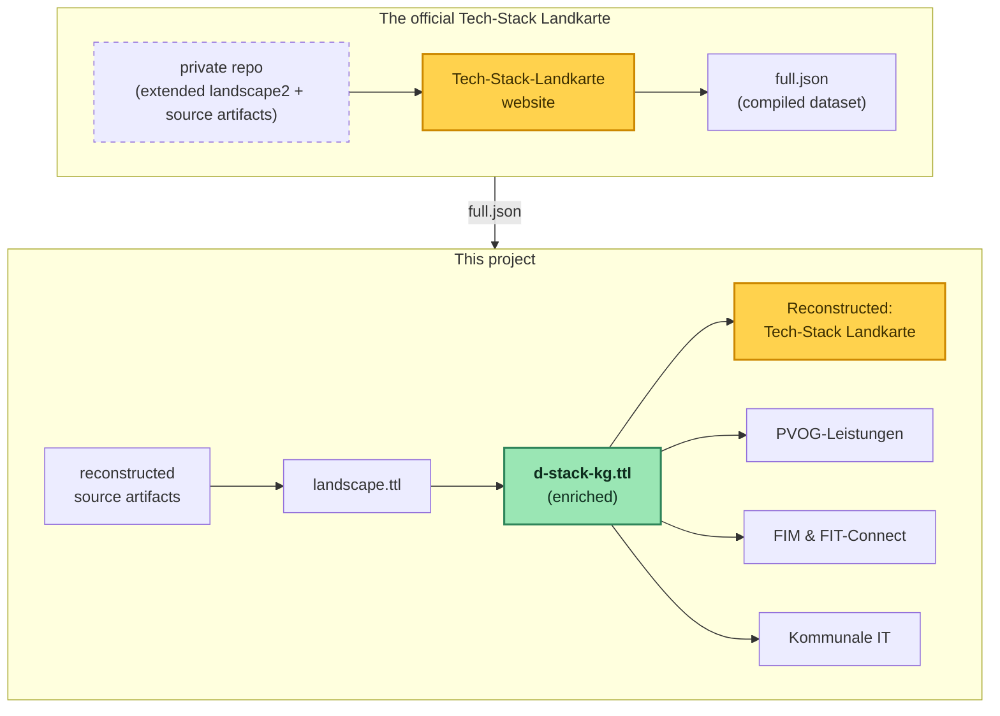

# Deutschland-Stack knowledge graph

This unofficial prototype explores possibilities that would arise from modeling the Deutschland-Stack as a knowledge graph. The data it uses is the reconstructed source artifact behind the compiled Landkarte dataset published online. The authoritative source is the official [Tech-Stack Landkarte](https://technologie.deutschland-stack.gov.de/).

- **Live site:** [benjaminaaron.codeberg.page/d-stack-kg](https://benjaminaaron.codeberg.page/d-stack-kg)
- Repository: [codeberg.org/benjaminaaron/d-stack-kg](https://codeberg.org/benjaminaaron/d-stack-kg)
- GitHub mirror (read-only): [github.com/benjaminaaron/d-stack-kg](https://github.com/benjaminaaron/d-stack-kg)

## Quickstart

The graph data is committed, so a fresh clone needs no fetching. One command builds the webapp's generated parts and serves it:

```bash
npm install
npm run demo
```

Then open the `localhost` URL it prints to browse the webapp. The only extra tool is the [landscape2](https://github.com/cncf/landscape2) CLI (`brew install cncf/landscape2/landscape2`), used to embed the Tech-Stack Landkarte; but even without it everything else still runs.

Everything below documents the full pipeline (re-generating the data from the live sources, and the individual steps). None of it is needed just to run the webapp.

## The big picture



## Requirements

- Node.js
- the [landscape2](https://github.com/cncf/landscape2) CLI (`brew install cncf/landscape2/landscape2`), for the Landkarte embed/roundtrip
- Java, only for *re-generating* data (the SPARQL Anything lift in `kg:build`/`*:fetch`; the jar auto-downloads)

Just running the app needs only the **Quickstart** above. To **re-generate the data from the live sources** instead of using the committed graph, run the `package.json` scripts top-to-bottom: `kg:build` → `pvog:fetch`/`fim:fetch`/`fit-connect:fetch` → `kg:enrich`, then the `landkarte:*` + `query-builder:prepare` prep (which `npm run demo` also does). The remaining sub-steps and checks (roundtrip validation, the standalone landscape2 server) aren't wired into npm scripts; run those files directly.

## Building the knowledge graph
`src/1-build-kg`

| Step | What it does |
|---|---|
| **1. Fetch dataset** | Fetches [the compiled dataset](https://technologie.deutschland-stack.gov.de/data/full.json) + logos → `data/1-build-kg/upstream/` |
| **2. Reconstruct source** | Rebuilds the landscape2 source (`landscape.yml` + a minimal `settings.yml`) → `data/1-build-kg/reconstructed/` |
| **3. Validate roundtrip** | Rebuilds `full.json` via `landscape2 build` and compares it structurally against the authoritative one |
| **4. Build graph** | Lifts `landscape.yml` to RDF (SPARQL Anything) and transforms it via SPARQL into the graph → `data/1-build-kg/landscape.ttl`. Modeling calls: [modeling-notes.md](modeling-notes.md) |

`npm run kg:build` chains steps 1, 2 and 4. Step 3 (roundtrip validation) is an optional check, run on its own: `node src/1-build-kg/3-validate-roundtrip.js`.

## Enriching the graph: the administrative layer
`src/2-enrich-kg`

The Landkarte describes what the Deutschland-Stack *runs on* — 128 standards and technologies — but nothing about what the state *does* with them. The enrich phase adds that floor: a handful of **Verwaltungsleistungen** pulled from the public PVOG Suchdienst as proof of concept, modelled with the EU public-service vocabularies (CPSV-AP / CCCEV). Real services from real authorities.

Two links reach down into the technical layer. One is **assumed**: `dstack:realisiertDurch` ties an Onlinedienst to the Landkarte elements it runs on, since no source records this (`pvog-dstack-bridge.assumed.ttl`). The other is **real**, joined by the **LeiKa-ID**: the **FIM Portal** adds each service's Steckbrief (legal basis, OZG-Themenfeld) and **FIT-Connect** the Zustellpunkt and Fachdatenschema, down to the individual data fields and their format. That chain is the *Vom Gesetz zur Einreichung* use case ([FIM & FIT-Connect page](webapp/use-case/fachdaten.html)); the modeling rationale (assumed vs. observed, the separate-layer design) is in [modeling-notes.md](modeling-notes.md).

| Layer | File | Built by |
|---|---|---|
| **Technical** | `data/2-enrich-kg/d-stack-kg.ttl` | `kg:enrich`: the lifted Landkarte |
| **Services (PVOG)** | `data/2-enrich-kg/pvog-leistungen.ttl` | `pvog:fetch`: Verwaltungsleistungen from PVOG |
| **Services (FIM)** | `data/2-enrich-kg/fim-leistungen.ttl` | `fim:fetch`: FIM Steckbriefe + one central FIM Datenschema |
| **Data schemas (FIT-Connect)** | `data/2-enrich-kg/fit-connect.ttl` | `fit-connect:fetch`: Zustellpunkte + Fachdatenschemata |
| **Bridge** | `authored/pvog-dstack-bridge.assumed.ttl` | hand-authored: the assumed `realisiertDurch` links |

Each `*:fetch` reads a public API and converts to RDF with the build-kg lift/transform idiom; only the converted TTL is committed, the raw responses are gitignored.

```bash
npm run pvog:fetch         # PVOG Suchdienst: services, authorities, online-service channels
npm run fim:fetch          # FIM Portal: Leistungs-Steckbriefe + a central FIM Datenschema
npm run fit-connect:fetch  # FIT-Connect: Zustellpunkte + the Fachdatenschemata they collect
npm run kg:enrich          # write the technical d-stack-kg.ttl (the fetches are optional; the committed TTL is enough)
```

## Preparing the webapp
`src/3-prepare-webapp`

### Landkarte roundtrip
Rebuilds the `landscape2` source files (`landscape.yml` + `settings.yml`) straight from the graph and proves the rebuilt site matches upstream.

```bash
npm run landkarte:prepare  # graph → landscape.yml + settings.yml
npm run landkarte:render   # render it into the webapp (webapp/public/use-case/landkarte/)
```

The [deploy](.forgejo/workflows/deploy.yml) runs `landkarte:prepare` and `landkarte:render` to publish the Landkarte embedded in the [Tech-Stack Landkarte page](webapp/use-case/landkarte.html).

### Query builder
Profiles the graph into the SHACL config that drives the in-browser [Sparnatural](https://github.com/sparna-git/Sparnatural) visual query builder on the Query page (one class per `rdf:type`, one facet per predicate used, widgets inferred from value types). Labels come from the [vocabulary](authored/vocabulary.ttl); a blocklist drops build-support predicates.

```bash
npm run query-builder:prepare # the full composed graph + vocabulary + blocklist → webapp/public/dstack.sparnatural.ttl
```

## Webapp
`webapp/`

```bash
npm run webapp:serve  # dev server
npm run webapp:build  # bundle to webapp/dist/
```

## Artifacts
`data/` (generated/fetched) and `authored/` (hand-written), kept apart on purpose.

Committed:

- `data/1-build-kg/upstream/`: the fetched Landkarte artifacts plus provenance
- `data/2-enrich-kg/d-stack-kg.ttl`: the technical knowledge graph
- `data/2-enrich-kg/pvog-leistungen.ttl`, `fim-leistungen.ttl`, `fit-connect.ttl`: the administrative layers (PVOG services / FIM Steckbriefe + a central FIM Datenschema / FIT-Connect Zustellpunkte + Fachdatenschemata)
- `authored/vocabulary.ttl`: the work-in-progress vocabulary (rendered on the webapp's vocabulary page)
- `authored/pvog-dstack-bridge.assumed.ttl`: the assumed `realisiertDurch` bridge from services to D-Stack elements
- `authored/musterstadt-it-landschaft.fictional.ttl`: a fictional municipal IT landscape (ArchiMate, checked against the D-Stack)
- `authored/musterstadt-chatbot.scenario.ttl`: a hypothetical new project (Bürger-Chatbot) for that landscape, modelled as capabilities with candidate Stack elements

Gitignored: the intermediates (incl. `data/1-build-kg/landscape.ttl`), the fetched PVOG/FIM/FIT-Connect responses + lift intermediates (`data/2-enrich-kg/{pvog,fim,fit-connect}/`), the use-case projections, and `data/scratch/`.

## Possible future work

Potential reuse targets and enrichment tasks: which existing vocabularies to reuse, and which enrichments to apply to the data already in hand. This is the technical companion to the [ideas page](webapp/ideen.html).

| Reuse | to |
|---|---|
| **GerPS** ontologies (openDVA / Uni Jena) | lift FIM `XDatenfelder`/`XProzess` *content* into RDF, already aligned to the EU Core Vocabularies |
| **CPSV-AP** + **CCCEV** (EU / SEMIC) | go beyond the service core to eligibility criteria + evidence |
| **DCAT-AP.de** | catalogue the registers behind the data fields (already used for the ARS regional key) |
| **Wikidata** | link every responsible body and standard out to the open web |
| **eLexa** / interoperable Rechtsbegriffe (BMF/BMDS) | model deduplicated legal terms |

**Enriching the graph**

- `verantwortlicheStelle` strings (~70 orgs: IETF, W3C, …) → Wikidata-linked entities
- relation edges between the items (`dependsOn`, `implements`, `competesWith`) → connect the 128 currently-isolated items into one graph
- the legal-term layer (Rechtsbegriff, data field, evidence, register) on top of the services already ingested

## Disclaimer

- Not an authoritative source. This is an unofficial reconstruction of official artifacts.
- The Landkarte data (`data/1-build-kg/upstream/full.json`) is content of the BMDS / Datenlabor BMI. No license is stated upstream; `data/1-build-kg/upstream/full.meta.json` is kept as provenance documentation.
- The item logos are kept verbatim in `data/1-build-kg/upstream/logos.zip` only to rebuild the site; no rights to them are claimed.
- The administrative data (`data/2-enrich-kg/pvog-leistungen.ttl`, `fim-leistungen.ttl`, `fit-connect.ttl`) is public-sector content derived from the FITKO PVOG Suchdienst, the FIM Portal and FIT-Connect; each ingested record (Leistung, Zustellpunkt, Schema) carries its exact `dct:source` and retrieval date as provenance. The raw API responses are gitignored working files, not committed.
- Built with the help of AI coding tools; design decisions stay with the author, who reviews, understands and takes responsibility for every change. Although, in all honesty, compartmentalized code blocks (a fetch script, say, or code that merely executes a declarative instruction such as a SPARQL transform) are sometimes reviewed only loosely.
