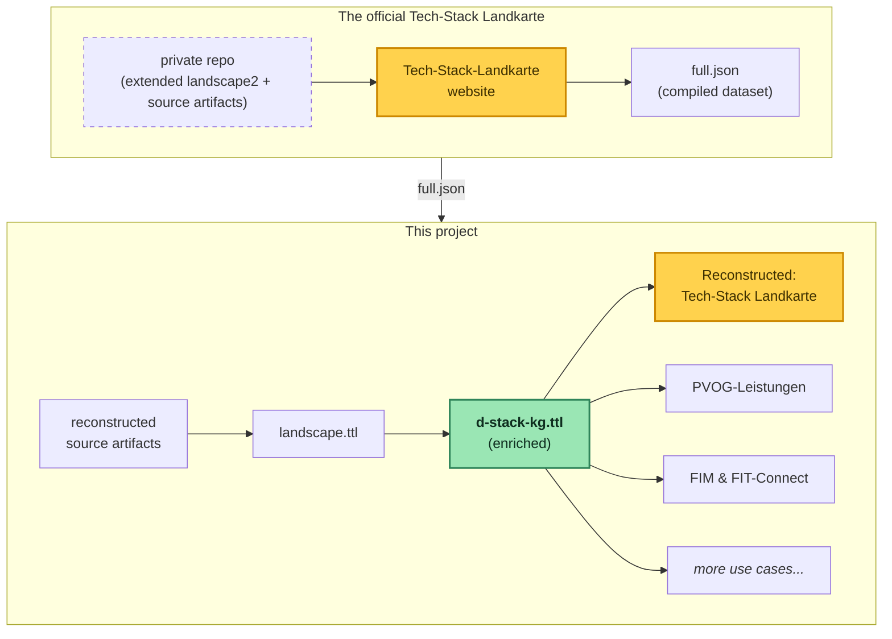

# Deutschland-Stack knowledge graph

This unofficial prototype explores possibilities that would arise from modeling the Deutschland-Stack as a knowledge graph. The data it uses is the reconstructed source artifact behind the compiled Landkarte dataset published online. The authoritative source is the official [Tech-Stack Landkarte](https://technologie.deutschland-stack.gov.de/).

- **Live site:** <https://benjaminaaron.codeberg.page/d-stack-kg>
- GitHub mirror (read-only): <https://github.com/benjaminaaron/d-stack-kg>

## The big picture



## Requirements

- Node.js
- Java for the SPARQL Anything lift in build step 4 (the jar auto-downloads)
- the [landscape2](https://github.com/cncf/landscape2) CLI for the roundtrip build/validate/serve (`brew install cncf/landscape2/landscape2`)

The package.json scripts cover only the default path: build the graph → enrich → build the use cases → run the webapp. Everything else (per-stage sub-steps, the roundtrip validation, the standalone landscape2 server) isn't wired up - but you can always run it directly. For the full experience from a fresh clone, run `npm install` and then the scripts in the order they appear in `package.json` (top to bottom) - that walks the whole pipeline end to end, from fetching the upstream dataset to the running webapp. Alternatively, start at `landkarte:prepare` - the enriched graph it consumes (`data/2-enrich-kg/d-stack-kg.ttl`) is committed, so `kg:build` and `kg:enrich` are optional.

## Building the knowledge graph
`src/1-build-kg`

| Step | What it does |
|---|---|
| **1. Fetch dataset** | Fetches [the compiled Landkarte dataset](https://technologie.deutschland-stack.gov.de/data/full.json) and its logos → `data/1-build-kg/upstream/` (`full.json` + metadata, `logos.zip`) |
| **2. Reconstruct source** | Reconstructs the landscape2 source files → `data/1-build-kg/reconstructed/` (`landscape.yml` + a minimal `settings.yml`)                                                               |
| **3. Validate roundtrip** | Structurally compares the rebuilt `full.json` against the authoritative one; to produce it, runs a full `landscape2 build` → `data/scratch/build/`                          |
| **4. Build graph** | Lifts `landscape.yml` to RDF with SPARQL Anything and transforms it via SPARQL queries into a knowledge graph → `data/1-build-kg/landscape.ttl`. More about the modeling choices along the way in [modeling-choices.md](modeling-choices.md) |

`npm run kg:build` chains steps 1, 2 and 4. Step 3 (roundtrip validation) is an optional check, run on its own: `node src/1-build-kg/3-validate-roundtrip.js`.

## Enriching the graph: the administrative layer
`src/2-enrich-kg`

The Landkarte describes what the Deutschland-Stack *runs on* — 128 standards and technologies — but nothing about what the state *does* with them. The **PVOG** (Portalverbund Online-Gateway), FITKO's federal gateway, has that: administrative services in Germany as XZuFi/FIM data. The enrich phase pulls a handful of Verwaltungsleistungen as proof of concept from the public PVOG Suchdienst and models them with the EU public-service vocabularies (CPSV-AP / CCCEV). Real services from real authorities.

**The gap.** Nothing records which technologies a given service runs on. A single predicate, `dstack:realisiertDurch`, links a real Onlinedienst to the **real Landkarte elements** it is built on; since no source records this, those links are **informed assumptions** (`pvog-dstack-bridge.assumed.ttl`), not derived data.

**The depth layer (FIM + FIT-Connect).** A second enrichment goes deeper on the same Leistungen, joined by the real **LeiKa-ID** rather than an assumed bridge: the **FIM Portal** adds each service's Steckbrief (legal basis, OZG-Themenfeld), and **FIT-Connect** adds the **Zustellpunkt** a Behörde registers to receive submissions plus the **Fachdatenschema** they must conform to, down to the individual FIM data fields and the Landkarte format tile they ride in. This is the *Vom Gesetz zur Einreichung* use case, explored on the [FIM & FIT-Connect page](webapp/use-case/fachdaten.html).

The graph is kept as **separate layer files** with distinct provenance, composed into one store by whatever needs the join (the Landkarte roundtrip loads only the technical layer). More in [modeling-choices.md](modeling-choices.md).

| Layer | File | Built by |
|---|---|---|
| **Technical** | `data/2-enrich-kg/d-stack-kg.ttl` | `kg:enrich`: the lifted Landkarte |
| **Services (PVOG)** | `data/2-enrich-kg/pvog-leistungen.ttl` | `pvog:fetch`: Verwaltungsleistungen from PVOG |
| **Services (FIM)** | `data/2-enrich-kg/fim-leistungen.ttl` | `fim:fetch`: FIM Steckbriefe + one central FIM Datenschema |
| **Data schemas (FIT-Connect)** | `data/2-enrich-kg/fit-connect.ttl` | `fit-connect:fetch`: Zustellpunkte + Fachdatenschemata |
| **Bridge** | `authored/pvog-dstack-bridge.assumed.ttl` | hand-authored: the assumed `realisiertDurch` links |

Each `*:fetch` reads a public API and converts to RDF with the build-kg lift/transform idiom; only the converted TTL is committed, the raw responses are gitignored.

```bash
npm run pvog:fetch         # PVOG Suchdienst: services, authorities, online-service channels
npm run fim:fetch          # FIM Portal: Leistungs-Steckbriefe + a central FIM Datenschema
npm run fit-connect:fetch  # FIT-Connect: Zustellpunkte + the Fachdatenschemata they collect
npm run kg:enrich          # write the technical d-stack-kg.ttl (the fetches are optional; the committed TTL is enough)
```

## Preparing the webapp
`src/3-prepare-webapp`

### Landkarte roundtrip
Rebuilds the `landscape2` source files (`landscape.yml` + `settings.yml`) straight from the graph and proves the rebuilt site matches upstream.

```bash
npm run landkarte:prepare  # graph → landscape.yml + settings.yml
npm run landkarte:render   # render it into the webapp (webapp/public/use-case/landkarte/)
```

The [deploy](.forgejo/workflows/deploy.yml) runs `landkarte:prepare` and `landkarte:render` to publish the Landkarte embedded in the [Tech-Stack Landkarte page](webapp/use-case/landkarte.html).

### Query builder
Profiles the graph (one class per `rdf:type`, one facet per predicate actually used on it, widgets inferred from the value types) into the SHACL config that drives the in-browser [Sparnatural](https://github.com/sparna-git/Sparnatural) visual query builder on the Query page. Labels come from the [vocabulary](authored/vocabulary.ttl); a blocklist in the script drops build-support predicates.

```bash
npm run query-builder:prepare # the three graph layers + vocabulary + blocklist → webapp/public/dstack.sparnatural.ttl
```

## Webapp
`webapp/`

```bash
npm run webapp:serve  # dev server
npm run webapp:build  # bundle to webapp/dist/
```

## Data

`data/` mirrors the `src/` folder. The committed artifacts are:

- `data/1-build-kg/upstream/`: the fetched Landkarte artifacts plus provenance
- `data/2-enrich-kg/d-stack-kg.ttl`: the technical knowledge graph
- `data/2-enrich-kg/pvog-leistungen.ttl`: the administrative services layer (ingested from PVOG)
- `data/2-enrich-kg/fim-leistungen.ttl`: FIM Steckbriefe + a central FIM Datenschema (FIM Portal)
- `data/2-enrich-kg/fit-connect.ttl`: FIT-Connect Zustellpunkte + the Fachdatenschemata they collect

The intermediates (incl. `data/1-build-kg/landscape.ttl`), the fetched PVOG/FIM/FIT-Connect responses + lift intermediates (`data/2-enrich-kg/{pvog,fim,fit-connect}/`), the use-case projections and `data/scratch/` are gitignored.

## Authored RDF
`authored/`

The project's hand-written RDF, kept apart from the generated/fetched `data/`:

- `authored/vocabulary.ttl`: the work-in-progress vocabulary used in the knowledge graph (rendered on the webapp's vocabulary page)
- `authored/pvog-dstack-bridge.assumed.ttl`: the assumed `realisiertDurch` bridge — the one hand-authored graph layer

## Possible future work

A scratchpad of where this could go. Ideas? Please share!

| Reuse | to |
|---|---|
| **GerPS** ontologies (openDVA / Uni Jena) | lift FIM `XDatenfelder`/`XProzess` *content* into RDF, already aligned to the EU Core Vocabularies |
| **CPSV-AP** + **CCCEV** (EU / SEMIC) | go beyond the service core to eligibility criteria + evidence |
| **DCAT-AP.de** | catalogue the registers behind the data fields (already used for the ARS regional key) |
| **Wikidata** | link every responsible body and standard out to the open web |
| **eLexa** / interoperable Rechtsbegriffe (BMF/BMDS) | model deduplicated legal terms |

**Enriching the graph**

- `verantwortlicheStelle` strings (~70 orgs: IETF, W3C, …) → Wikidata-linked entities
- relation edges between the items (`dependsOn`, `implements`, `competesWith`) → connect the 128 currently-isolated items into one graph
- the legal-term layer (Rechtsbegriff, data field, evidence, register) on top of the services already ingested

## Observations

A few things surfaced while working with the Landkarte's published artifacts:

- The two CSV files under Download (top right corner) are lossy exports of the build output (default landscape2 behaviour, not a BMDS addition), missing content compared to the `landscape.yml` and `settings.yml` they were built from. Those probably live in the repository the footer links to, which seems to have been public once but now returns a 404.
- The data model is inherited from the CNCF landscape and fits its new purpose imperfectly. Some fields are repurposed: license information appears under `summary.release_rate` and operating systems under `summary.personas`.
- Category and subcategory labels carry inconsistent leading whitespace — a mix of a normal space (U+0020) and an en-quad (U+2000) — so one category is split across several distinct strings. The reconstruction normalizes them to recover the four intended categories.

## Disclaimer

- Not an authoritative source. This is an unofficial reconstruction of official artifacts.
- The Landkarte data (`data/1-build-kg/upstream/full.json`) is content of the BMDS / Datenlabor BMI. No license is stated upstream; `data/1-build-kg/upstream/full.meta.json` is kept as provenance documentation.
- The item logos are kept verbatim in `data/1-build-kg/upstream/logos.zip` only to rebuild the site; no rights to them are claimed.
- The administrative data (`data/2-enrich-kg/pvog-leistungen.ttl`, `fim-leistungen.ttl`, `fit-connect.ttl`) is public-sector content derived from the FITKO PVOG Suchdienst, the FIM Portal and FIT-Connect; each fact carries its exact `dct:source` and retrieval date as provenance. The raw API responses are gitignored working files, not committed.
- Built with the help from AI coding tools; design decisions stay with the author, who reviews, understands and takes responsibility for every change.
